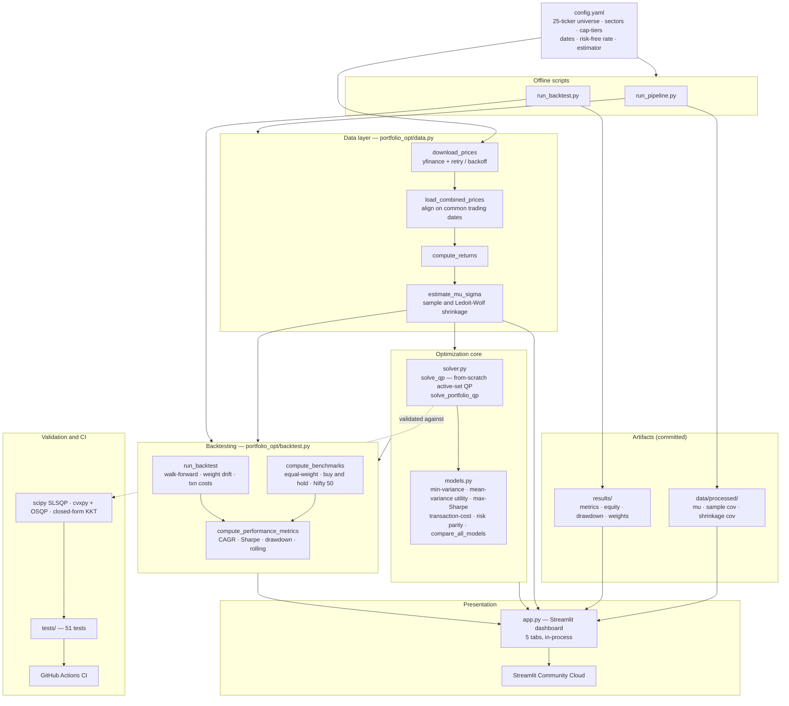

# Quadratic Programming Portfolio Optimization

[](https://github.com/lokeshpatil28/Stock-Market-Portfolio-Optimization/actions/workflows/ci.yml)

**Live demo:** https://stock-market-portfolio-optimization-kpz839gnv9cnuuxxnljsf2.streamlit.app/

A constrained portfolio optimizer for a 25-stock NSE universe, built around a
**from-scratch active-set quadratic-programming solver** (pure NumPy, no
`cvxpy`/`scipy` in the hot path). It estimates expected returns and a
shrinkage covariance matrix from price history, solves five different portfolio
construction models under realistic constraints (long-only, per-asset caps,
sector caps, turnover and tracking-error limits), runs a transaction-cost-aware
walk-forward backtest against equal-weight and Nifty-50 benchmarks, and serves
the whole thing as an interactive Streamlit dashboard.

---

## Background

This project originated as a 3-member **Operations Research coursework**
submission: a basic Markowitz mean-variance optimization over 10 stocks with
~6 months of data, solved by setting up the **unconstrained KKT linear system**
(equality constraints only) and handling the long-only constraint with a
**clip-and-renormalize hack** — solve unconstrained, set negative weights to
zero, then rescale. That hack is mathematically incorrect: the resulting point
does not satisfy the KKT conditions of the long-only problem, and renormalizing
silently breaks the target-return constraint.

It was then **independently rebuilt and extended solo** into a portfolio-grade
project:

- a **from-scratch active-set QP solver** that enforces inequality constraints
  correctly, validated to machine precision against three independent references;
- **five portfolio models** (min-variance, mean-variance utility, max-Sharpe,
  transaction-cost-aware, risk parity);
- **real-world constraints** (per-asset caps, sector caps, turnover limit,
  tracking-error limit);
- a **walk-forward backtester** with transaction costs and benchmarks;
- a **deployed interactive dashboard**.

The original coursework report is preserved in the repo (`Report.docx`); see
[Acknowledgment](#acknowledgment).

---

## Universe

25 NSE-listed instruments, chosen for **deliberate sector and cap-tier
diversity** so that the correlation structure and the sector-cap constraints
have something real to bind against — rather than 25 names that are secretly a
single cluster moving together.

| Sector | Constituents (cap-tier) |
|---|---|
| IT | TCS (Large), INFY (Large), TECHM (Large), PERSISTENT (Mid) |
| Banking — Private | HDFCBANK (Large), ICICIBANK (Large), FEDERALBNK (Mid) |
| Banking — PSU | SBIN (Large) |
| Pharma | SUNPHARMA (Large), DRREDDY (Large), LUPIN (Mid), AUROPHARMA (Mid) |
| FMCG | ITC (Large), HINDUNILVR (Large), NESTLEIND (Large), MARICO (Mid) |
| Energy | RELIANCE (Large), ONGC (Large) |
| Auto | MARUTI (Large), HEROMOTOCO (Large) |
| Auto Components | BHARATFORG (Mid) |
| Infra / Capital Goods | LT (Large) |
| Consumer Discretionary | TITAN (Large) |
| Aviation | INDIGO (Mid) |
| Alt — Gold | GOLDBEES (Alt, gold ETF) |

That's 12 sectors and three cap-tiers (Large / Mid / Alt). The gold ETF
(GOLDBEES) is deliberately included as a low-correlation diversifier. The
universe is defined entirely in `config.yaml`.

---

## Architecture



This is a **single-process application**: the Streamlit UI imports
`portfolio_opt` directly and runs every optimization and backtest **in-process**.
There is **no separate backend/API, no message queue, no Docker, no database** —
the data layer reads committed price CSVs and recomputes everything on demand,
cached with `@st.cache_data`.

That scope was deliberate. The compute is sub-second to a few seconds per
interaction, the dataset is small (25 assets × ~3 years), and there is a single
user per session. A microservice/containerized architecture would add operational
complexity and latency with no benefit here. The clean module boundaries
(`solver` → `models` → `backtest`) mean the core could be lifted behind an API
later if it ever needed to scale, but doing so now would be over-engineering.

---

## Models implemented

All five take expected returns `mu` and a covariance matrix `Sigma`. The QP
standard form solved by the custom solver is:

```
minimize    (1/2) xᵀ P x + qᵀ x
subject to  A_eq   x  = b_eq
            A_ineq x <= b_ineq
```

**1. Minimum variance for a target return** — *custom active-set QP, directly.*
```
minimize    xᵀ Σ x
subject to  μᵀx = target,  Σ xᵢ = 1,  0 <= xᵢ <= w_max,  (sector caps)
```
Built as `P = 2Σ`, `q = 0`.

**2. Mean-variance utility** — *custom active-set QP, directly.*
```
maximize  μᵀx − λ·xᵀΣx     ⇔     minimize  λ·xᵀΣx − μᵀx
```
Built as `P = 2λΣ`, `q = −μ`. With a **turnover limit**, the non-linear term
`Σ|xᵢ − prevᵢ| <= τ` is handled by an **exact L1-as-QP reformulation**:
auxiliary variables `uᵢ >= |xᵢ − prevᵢ|` turn it into purely linear constraints,
so it stays inside the active-set solver.

**3. Maximum Sharpe** — *frontier sweep of utility QPs.*
The Sharpe ratio `(μᵀx − r_f) / sqrt(xᵀΣx)` is a linear-fractional (only
quasi-concave) objective, **not** a QP. The tangency portfolio lies on the
efficient frontier, so we sweep `λ` across a grid of utility QPs (each solved by
the custom solver) and return the point with the highest Sharpe.

**4. Transaction-cost-aware** — *custom active-set QP, directly.*
```
maximize  μᵀx − λ·xᵀΣx − c·(x − x_prev)ᵀ(x − x_prev)
```
The quadratic cost penalty is **folded into the Hessian**: expanding
`c·(x − p)ᵀ(x − p)` gives `P = 2λΣ + 2c·I`, `q = −μ − 2c·x_prev`. Still a QP.

**5. Risk parity** — *SLSQP (scipy), not a QP.*
Equal-risk-contribution requires equalizing `RCᵢ = xᵢ·(Σx)ᵢ`, which are
**quadratic** in `x`; the natural objective `Σᵢ (RCᵢ − mean RC)²` is a
**non-convex quartic**. There is no QP form, so this is solved by `scipy`'s SLSQP.

**Tracking-error limit** (available on the utility model): the constraint
`(x − b)ᵀ Σ (x − b) <= te²` is **quadratic**, which the active-set solver (linear
constraints only) cannot represent — so that specific case is solved by SLSQP.
This is stated honestly in the code rather than faking QP support.

---

## Constraints supported

| Constraint | Form | Type |
|---|---|---|
| Budget | `Σ xᵢ = 1` | linear (equality) |
| Target return | `μᵀx = T` | linear (equality) |
| Long-only | `xᵢ ≥ 0` | linear |
| Per-asset cap | `xᵢ ≤ w_max` | linear |
| Sector cap | `Σ_{i∈s} xᵢ ≤ cap_s` | linear |
| Turnover limit | `Σ|xᵢ − prevᵢ| ≤ τ` | linear *(via L1 auxiliary-variable reformulation)* |
| Tracking-error limit | `(x−b)ᵀΣ(x−b) ≤ te²` | **quadratic** *(→ SLSQP)* |

Linear constraints are handled natively by the custom active-set solver. The
single quadratic constraint (tracking error) is delegated to SLSQP.

---

## Solver validation

The custom solver is checked against **three independent references** — not
just one:

1. **`scipy.optimize.minimize` (SLSQP)** — 10 seeded random QPs (`tests/test_solver.py`).
2. **`cvxpy` + OSQP** — portfolio QPs at increasing size (`tests/test_solver_validation.py`).
3. **Closed-form analytical KKT solution** — the n=2 global minimum-variance portfolio.

cvxpy/OSQP comparison (same problem, both solvers):

| n assets | constraints | max \|Δ weight\| | objective rel. diff |
|---|---|---|---|
| 2 | budget + return + box | 6.66e-16 | 2.15e-15 |
| 5 | + one bound binding | 1.55e-15 | 4.32e-15 |
| 10 | + per-asset cap binding | 9.71e-17 | 1.58e-15 |
| 25 | + 7 bounds binding | 1.15e-16 | 1.54e-15 |

Closed-form check (n=2 global min-variance, `x* = Σ⁻¹·1 / (1ᵀ·Σ⁻¹·1)`):
analytic `[0.7118644068, 0.2881355932]`, custom solver matches to **4.44e-16**.

Weight vectors agree to **~1e-15** — about 11 orders of magnitude tighter than
the 1e-4 acceptance tolerance — because the active-set method returns the exact
KKT solution rather than an iterative approximation. The full suite is **51
tests** (`pytest`).

---

## Backtest results

Walk-forward backtest, monthly rebalancing, 1-year trailing estimation window,
**10 bps** transaction cost on turnover. Out-of-sample period
**2024-08-01 → 2026-06-23** (~1.85 years, 23 rebalances). Returns/vol/drawdown
in %; benchmarks include the **real Nifty 50** (`^NSEI`).

| Strategy | CAGR | Vol | Sharpe | Max DD | Total Return | Avg Turnover |
|---|---|---|---|---|---|---|
| **Max Sharpe** | **9.21** | 14.81 | **0.26** | −14.19 | 17.74 | 0.466 |
| Utility (λ=50) | 7.32 | 11.82 | 0.15 | −13.72 | 13.99 | 0.311 |
| Utility (λ=10) | 5.84 | 15.53 | 0.06 | −15.45 | 11.09 | 0.476 |
| Risk parity | 5.40 | 11.49 | −0.01 | −13.68 | 10.24 | **0.101** |
| Utility (λ=2) | 4.40 | 18.31 | −0.00 | −14.95 | 8.31 | 0.553 |
| Min variance | 4.38 | **10.30** | −0.12 | **−12.73** | 8.26 | 0.286 |
| *Equal weight (bench)* | 3.69 | 12.42 | −0.13 | −15.42 | 6.94 | — |
| *Buy & hold equal (bench)* | 3.55 | 12.38 | −0.14 | −15.39 | 6.67 | — |
| *Nifty 50 (bench)* | **−2.59** | 13.49 | −0.57 | −15.77 | −4.75 | — |

**Reading these honestly:** the absolute Sharpe ratios are low because the
out-of-sample window was a weak, choppy period for Indian equities — the Nifty 50
itself *lost* 2.59%/yr, and the 6% risk-free rate sets a high bar for excess
return. So Sharpe is not the headline; **relative outperformance is**. Every
optimized strategy beat both equal-weight benchmarks and the Nifty 50 on CAGR.
Max-Sharpe returned **9.21%/yr vs the Nifty's −2.59%** (an ~11.8-point spread) at
a *smaller* max drawdown (−14.2% vs −15.8%); min-variance delivered the lowest
volatility (10.3%) and shallowest drawdown (−12.7%) exactly as intended; and
risk parity ran at ~5× lower turnover than the utility models.

> **Footnote on Sharpe vs CAGR.** The Sharpe ratio uses the standard definition —
> annualized **arithmetic** mean excess return over annualized volatility. The
> "CAGR" column is the **geometric** annualized return. These two return figures
> differ by the volatility drag (~½·σ²), so `(CAGR − r_f) / vol` will **not**
> reproduce the Sharpe column exactly. Both are standard; they just use different
> (arithmetic vs geometric) return conventions. This is pinned by a unit test.

---

## Sample allocation output

One real run — **Max-Sharpe**, full 25-asset universe, Ledoit-Wolf shrinkage
covariance (intensity 0.041). Expected return 32.0%, volatility 12.8%,
Sharpe 2.03 (in-sample, full history). "Risk contribution %" is each asset's
share of total portfolio variance — note where it diverges from weight (the
"weight ≠ risk" insight):

| Ticker | Sector | Weight % | Risk contribution % |
|---|---|---|---|
| GOLDBEES | Alt — Gold | 25.00 | 19.88 |
| FEDERALBNK | Banking — Private | 20.11 | 25.44 |
| LUPIN | Pharma | 18.16 | 23.31 |
| SUNPHARMA | Pharma | 12.94 | 10.05 |
| MARICO | FMCG | 8.48 | 4.68 |
| BHARATFORG | Auto Components | 5.84 | 7.83 |
| PERSISTENT | IT | 5.19 | 5.06 |
| SBIN | Banking — PSU | 1.52 | 1.25 |
| HEROMOTOCO | Auto | 1.45 | 1.21 |
| AUROPHARMA | Pharma | 1.19 | 1.18 |
| INDIGO | Aviation | 0.12 | 0.11 |

GOLDBEES hits the 25% per-asset cap; FEDERALBNK and LUPIN carry noticeably more
*risk* than their *weight* (higher-volatility names), which is precisely what the
risk-contribution view surfaces.

---

## Dashboard

Five tabs ([live demo](https://stock-market-portfolio-optimization-kpz839gnv9cnuuxxnljsf2.streamlit.app/)):

1. **Efficient Frontier** — risk-aversion sweep, your selected portfolio marked
   as a star, labeled min-variance and max-Sharpe points, the Capital Market Line,
   and an optional sample-vs-shrinkage frontier overlay.
2. **Allocation** — the primary "what to invest in" view: sorted weight / sector /
   risk-contribution table, weight bars, sector and cap-tier donuts, a
   weight-vs-risk grouped bar chart, and a correlation heatmap of the selection.
3. **Backtest** — equity curve vs equal-weight and Nifty 50, drawdown
   (underwater) chart, rolling 6-month Sharpe, weight-over-time stacked area, and
   a side-by-side metrics table.
4. **Solver Validation** — the cvxpy/OSQP comparison table and a plain-language
   explanation of the active-set method and KKT conditions.
5. **Model Comparison** — all five models on the current universe/constraints:
   wide weight table, grouped bars, and a Sharpe-sorted summary.

Sidebar controls: sector-labeled ticker multiselect, model picker,
risk-aversion / target-return / max-weight / turnover sliders, a sample-vs-
shrinkage covariance toggle (with live shrinkage intensity), per-sector caps,
and the risk-free rate.

---

## How to run locally

```bash
# 1. Install the package with dev + data extras
pip install -e ".[dev,data]"

# 2. Download prices and build mu / covariance matrices into data/processed/
python scripts/run_pipeline.py

# 3. Run the full walk-forward backtest across all strategies into results/
python scripts/run_backtest.py

# 4. Launch the dashboard
streamlit run app.py

# (run the test suite)
pytest
```

---

## Tech stack

- **Language:** Python 3.11
- **Numerical computing:** NumPy (the active-set QP solver is hand-written in NumPy)
- **Optimization:** custom active-set convex-QP solver; SLSQP (SciPy) for the non-QP cases (risk parity, tracking-error constraint)
- **Data:** pandas, yfinance
- **Statistics:** scikit-learn (Ledoit-Wolf shrinkage covariance)
- **Validation:** SciPy SLSQP, cvxpy + OSQP, closed-form analytical KKT
- **Testing:** pytest (51 tests)
- **CI/CD:** GitHub Actions
- **Dashboard:** Streamlit + Plotly
- **Deployment:** Streamlit Community Cloud

---

## Repository structure

```
.
├── app.py                       # Streamlit dashboard (5 tabs)
├── config.yaml                  # universe (sector + cap-tier), dates, estimator, risk-free rate
├── pyproject.toml               # installable package (hatchling); base deps + [data]/[plot]/[dev]
├── requirements.txt             # pinned runtime deps for Streamlit Cloud
├── runtime.txt                  # Python 3.11 pin for Streamlit Cloud
│
├── portfolio_opt/               # the installable package
│   ├── solver.py                # from-scratch active-set QP solver (+ solve_portfolio_qp)
│   ├── data.py                  # config-driven price pipeline + mu/Sigma estimation
│   ├── models.py                # 5 portfolio models + compare_all_models
│   └── backtest.py              # walk-forward engine, benchmarks, performance metrics
│
├── scripts/
│   ├── run_pipeline.py          # prices -> data/processed/ (mu, sample & shrinkage covariances)
│   └── run_backtest.py          # full walk-forward backtest -> results/
│
├── tests/                       # 51 tests
│   ├── test_solver.py           #   solver vs scipy SLSQP + edge cases
│   ├── test_solver_validation.py#   solver vs cvxpy/OSQP + closed-form
│   ├── test_data.py             #   pipeline alignment / shrinkage PSD
│   ├── test_models.py           #   5 models, constraints, compare_all
│   └── test_backtest.py         #   walk-forward engine, Sharpe-formula pin
│
├── data/
│   ├── prices/                  # per-ticker close CSVs (25 current *.NS.csv + 10 legacy)
│   ├── processed/               # mu.npy, cov_sample.npy, cov_shrinkage.npy, shrinkage_intensity.txt
│   └── mu.npy, cov.npy, ...      # legacy 10-asset coursework inputs (kept as a "before" artifact)
│
├── results/                     # current backtest outputs (equity, drawdown, rolling Sharpe, metrics)
│
├── extras/
│   ├── alternate_formulations/  # simplex_tableau.py — early LP/simplex exploration (not in pipeline)
│   └── legacy_coursework_results/ # original coursework outputs (kept as a "before" artifact)
│
├── .github/workflows/ci.yml     # CI: pip install -e ".[dev,data]" + pytest, Python 3.11
├── .devcontainer/               # GitHub Codespaces config
├── Report.docx                  # original 3-member coursework report
└── README.md
```

---

## Limitations and future work

- **Historical returns as a proxy for expected returns.** `mu` is the sample mean
  of past returns; mean-variance optimization is notoriously sensitive to
  estimation error in `mu`, which is why Ledoit-Wolf shrinkage is applied to the
  covariance and per-asset / sector caps are used to keep allocations from
  concentrating on noisy point estimates.
- **No liquidity / intraday / slippage modeling** beyond a flat per-turnover
  basis-point transaction cost. Real execution cost is price-impact- and
  volume-dependent.
- **Mild survivorship bias.** The fixed 25-stock universe is today's well-known
  large/mid-caps, not a point-in-time-correct historical membership — a name that
  had been delisted or fallen out of favor wouldn't be here.
- **Only ~3 years of history.** The window is config-driven (`config.yaml`) and
  trivial to extend; a longer history would make the backtest statistics more
  robust (the current out-of-sample window is ~1.85 years).
- **Scoped-but-not-yet-built extensions:** CVaR (conditional value-at-risk)
  optimization for tail-risk control, and cardinality-constrained (sparse)
  portfolios that cap the *number* of holdings — both require going beyond the
  convex-QP form (CVaR via LP, cardinality via mixed-integer programming).

---

## Acknowledgment

This project began as a 3-member Operations Research coursework submission
(the original report is included as `Report.docx`). The work documented here —
the from-scratch validated active-set QP solver, the additional models and
constraints, the walk-forward backtester, and the deployed dashboard — is an
independent solo rebuild and extension of that starting point.
